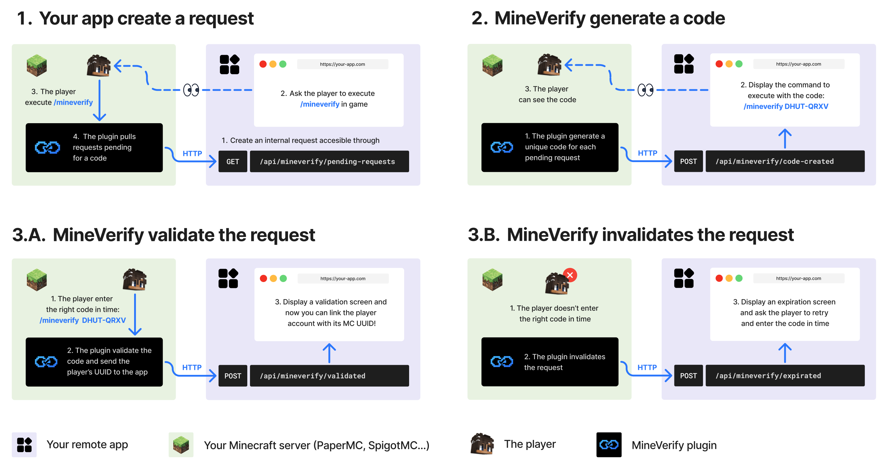

<div align="center">

# MineVerify

Lightweight PaperMC plugin allowing apps to verify Minecraft players through generated in-game codes.

</div>

## 📋 Overview

MineVerify lets external apps verify that a Minecraft account is controlled by a real player on
your server.

The app creates an internal verification request and asks the player to run `/mineverify`.
The plugin then polls configured apps, generates a temporary code, validates `/mineverify <code>`
in game, and reports the verified Minecraft UUID and username back to the app.

MineVerify only makes outbound requests to configured apps. It does not expose a public HTTP API on
the Minecraft server.



## ✨ Features

- Verifies that a real connected Minecraft player owns a generated code
- Lets several external apps use the same Minecraft server for verification
- Keeps the Minecraft server private by using outbound app calls only
- Sends the app the verified Minecraft UUID and username after validation
- Expires unused codes automatically
- Provides admin status commands to inspect current verification activity
- Supports localized in-game messages

## 🚀 Installation

1. Install a [PaperMC server](https://papermc.io/downloads/paper) with Java 25+
2. Download the latest `MineVerify-x.x.x+mcx.x.x.jar` from the [releases page](https://github.com/Sukikui/MineVerify/releases)
3. Drop the jar into your server's `plugins/` folder
4. Restart the server or run `/reload confirm`
5. Configure your apps in `plugins/MineVerify/config.yml`

## 🕹 Command Usage

| Command | Permission | Description |
| --- | --- | --- |
| `/mineverify` | `mineverify.use` | Starts checking configured apps for pending verification requests. |
| `/mineverify <code>` | `mineverify.use` | Validates a generated code for the connected player. |
| `/mineverify status` | `mineverify.admin` | Shows polling state, configured apps, stored requests, and last app responses. |
| `/mineverify status requests` | `mineverify.admin` | Shows admin status with stored request details. |

`/mineverify` and `/mineverify <code>` must be run by a real player. Admin status commands can be
run by admins or from the console.

## ⚙️ Configuration

[`config.yml`](src/main/resources/config.yml) defines the language, remote apps, and code validity.

```yaml
language: "en_us"

apps:
  my-app:
    name: "Your App"
    base-url: "https://your-app.com"
    token: "generated-token-from-your-app"
    poll-interval-seconds: 3

linking:
  code-ttl-seconds: 60
```

| Key | Default | Description |
| --- | --- | --- |
| `language` | `en_us` | In-game message language. Available values are listed in `config.yml`. |
| `apps.<id>.name` | `<id>` | Player-facing app name. |
| `apps.<id>.base-url` | Required | App backend base URL. |
| `apps.<id>.token` | Required | Bearer token used by MineVerify when calling this app. |
| `apps.<id>.poll-interval-seconds` | `3` | Poll interval used only during an active player-triggered polling session. |
| `linking.code-ttl-seconds` | `60` | Generated code validity duration. |

## 🔁 Verification Flow

1. The app creates an internal request for its own user.
2. The app asks the player to join the Minecraft server and run `/mineverify`.
3. **MineVerify** starts a temporary polling session.
4. **MineVerify** calls each configured app for pending requests.
5. **MineVerify** generates a code for each new pending request and sends it to the owning app.
6. The app shows `/mineverify <code>` to the user.
7. The player runs `/mineverify <code>` in game.
8. **MineVerify** validates the code and reads the connected player's UUID and username.
9. **MineVerify** reports either validation or expiration to the app.

## 🔌 App Endpoints

It's always **MineVerify** that contacts the app, never the opposite.
In this way, each app configured in `config.yml` must implement these endpoints on its own backend.

| Endpoint | Method | Description |
| --- | --- | --- |
| `/api/mineverify/pending-requests` | `GET` | Returns app requests waiting for a generated code. |
| `/api/mineverify/code-created` | `POST` | Receives the generated code and expiration time. |
| `/api/mineverify/validated` | `POST` | Receives the verified Minecraft UUID and username. |
| `/api/mineverify/expired` | `POST` | Receives an expiration event when the code was not validated in time. |

Every request sent by **MineVerify** includes:

```http
Authorization: Bearer <app-token>
```

> [!IMPORTANT]
> To fully integrate **MineVerify** into your app, follow
> [`docs/APP_INTEGRATION.md`](docs/APP_INTEGRATION.md).

---

<div align="center">
Crafted by

Sukikui
</div>
